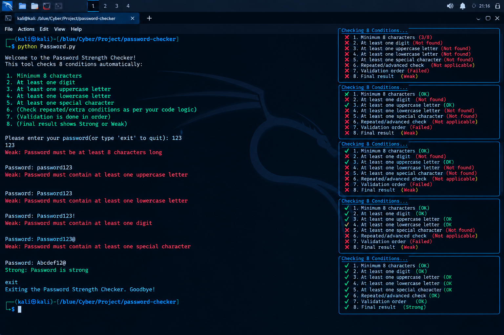

# 🔐 Password Strength Checker

A simple Python-based Password Strength Checker that validates passwords against multiple security conditions.

## Features

- Minimum 8 characters
- At least one digit
- At least one uppercase letter
- At least one lowercase letter
- At least one special character
- Automatic password validation
- Strong / Weak password result
- Command-line interface

## 🛠️ Technologies Used

- Python 3
- Regular Expressions (`re`)

## ▶️ How to Run

```bash
python Password.py
```

## 📸 Project Preview



## 🎯 Purpose

This project was created for learning Python programming and understanding basic password security concepts.

## 👨‍💻 Author

GitHub: https://github.com/repk4765

Blue_rpk
